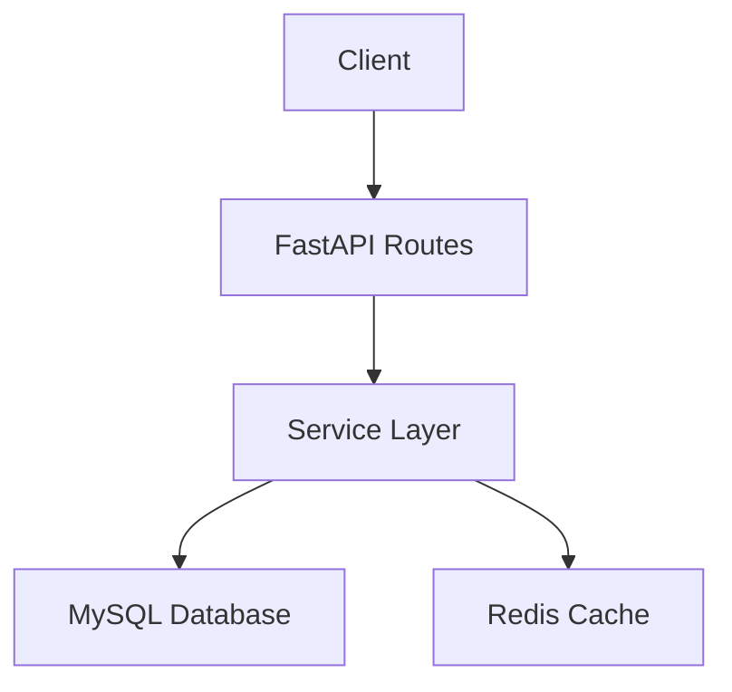
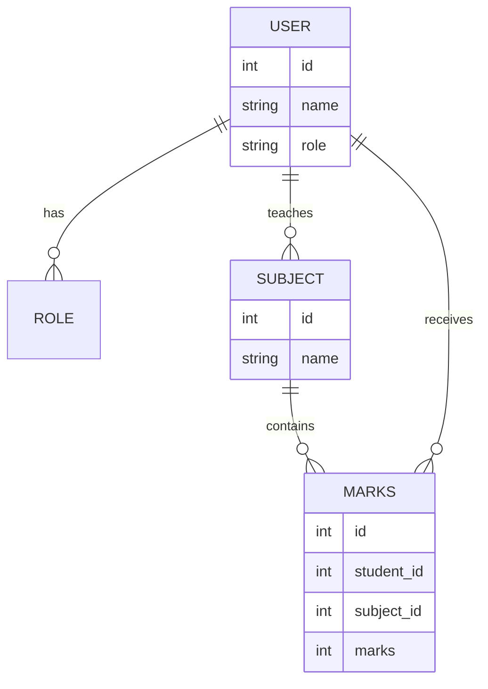
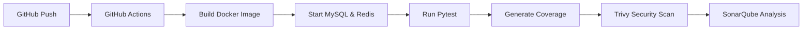

# 🚀 Role-Based Academic Management Backend System

## 📌 Overview

This project is a **Dockerized FastAPI backend** demonstrating strong backend engineering practices including **role-based access control, clean architecture, CI/CD, testing, and monitoring**.

It models an academic workflow where:

* Admins manage users and subjects
* Teachers are assigned to subjects
* Teachers can add and manage student marks
* Students can view their records

---

# 🧠 System Architecture



---

# 🗄️ ER Diagram (Database Design)



---

# 🔐 Role-Based Access Control (RBAC)

| Role    | Permissions             |
| ------- | ----------------------- |
| Admin   | Full system access      |
| Teacher | Manage subjects & marks |
| Student | View-only access        |

Access is enforced using dependency-based permission checks.

---

# 📊 Core Features

### ✅ User & Role Management

* Create users
* Assign roles
* Manage access

### ✅ Academic Data Management

* Subject creation and assignment
* Marks entry and updates
* Student performance tracking

### ✅ Validation & Error Handling

* Pydantic validation
* Proper HTTP status codes
* Structured error responses

---

# ⚙️ DevOps & CI/CD Pipeline



---

# 🧪 Testing

* End-to-end API testing using pytest
* Covers real workflows
* Automated in CI pipeline

---

# 🔍 Security & Monitoring

* Security scanning using Trivy
* Monitoring using Prometheus
* Code quality analysis using SonarQube

---

# 📬 API Examples

### 🔹 Create User

```http
POST /users
```

```json
{
  "name": "Aditya",
  "role": "teacher"
}
```

---

### 🔹 Assign Subject

```http
POST /subjects/assign
```

```json
{
  "teacher_id": 1,
  "subject_id": 2
}
```

---

### 🔹 Add Marks

```http
POST /marks
```

```json
{
  "student_id": 5,
  "subject_id": 2,
  "marks": 88
}
```

---

### 🔹 Get Student Marks

```http
GET /marks/{student_id}
```

---

# 🚀 Tech Stack

* Backend: FastAPI
* Database: MySQL
* Cache: Redis
* Testing: Pytest
* CI/CD: GitHub Actions
* Monitoring: Prometheus
* Security: Trivy
* Code Quality: SonarQube

---

# 📦 Setup Instructions

```bash
git clone <https://github.com/Aditya2458/fastapi_backend.git>
cd project

docker-compose up --build
```

---

# 📬 API Docs

```bash
http://localhost:8000/docs
```

---

# 🧾 Why This Project Stands Out

* Clean architecture (routes, services, models separation)
* Strong RBAC implementation
* Production-level tooling (Docker, CI/CD, monitoring)
* Real-world testing setup
* Scalable backend design

---

# 🧠 Conclusion

This project demonstrates the ability to design and build a **robust, scalable backend system** with proper access control, structured data handling, and production-ready engineering practices.
